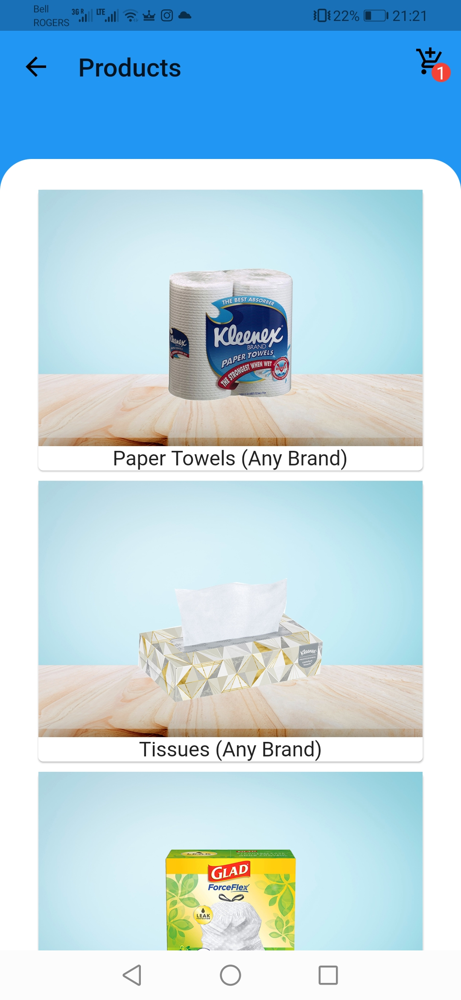
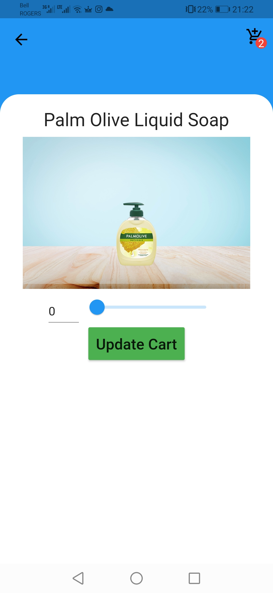
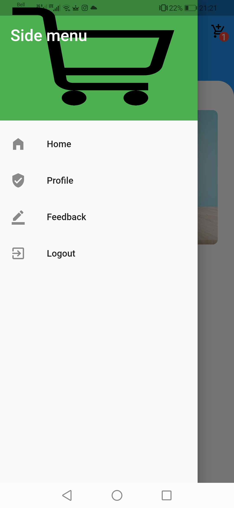
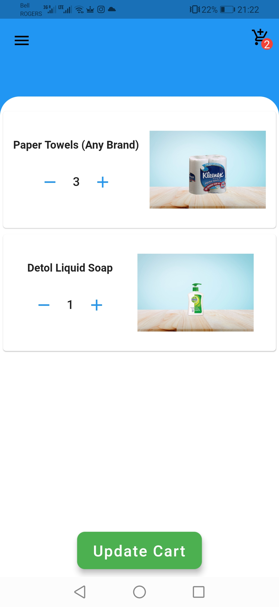

This flutter application was created as a minimal viable product (MVP) which was intended to be a prototype to test the client's business idea. The project was created in flutter due to the client's need for both a mobile application and a website in the future. 

