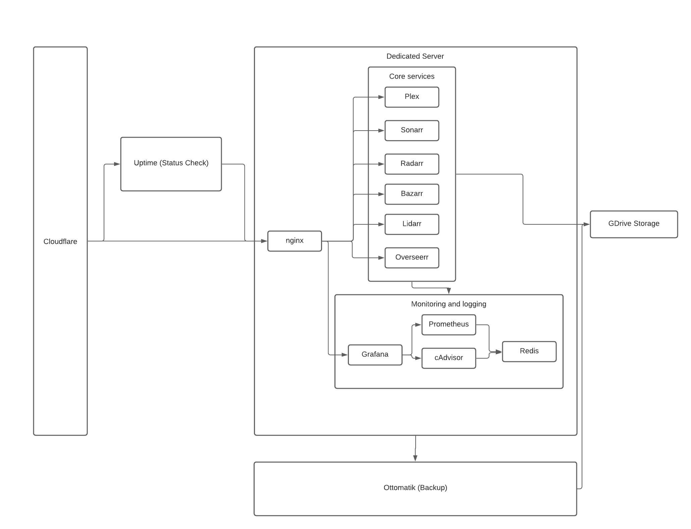

This is one of my favorite personal projects. I set up an automated media server using plex and multiple other open source tools. The purpose of the project is to give access to media for family and friends. The whole setup runs on a dedicated server to provide 24/7 access to the server. All applications are containerized using docker and all configs are backed up using ottomatik. Monitoring is done through grafana and all its collection services. And email notifications are setup to notify me if any of the services are down using uptime's free service.