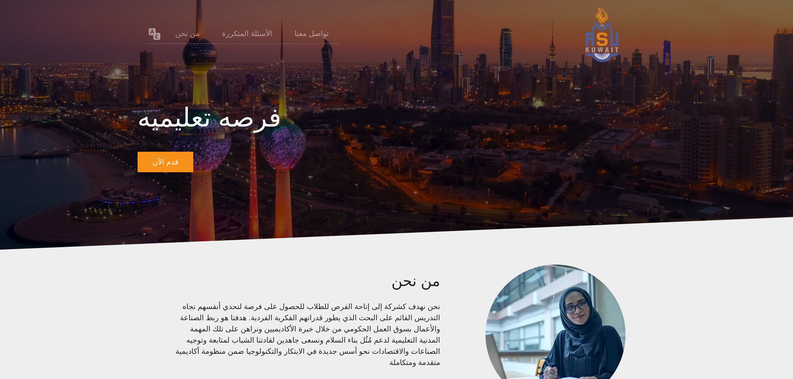

This frontend Vue.js application is using bootstrap for CSS and is deployed through Google Cloud Product (GCP). The challenging aspect of this project was to have the page support multi-language. The two languages used were English and Arabic, Arabic is written from right to left. The challenge with this project was to be able to switch between languages locally and have the CSS update accordingly while maintaining a  responsive layout through mobile and desktop clients. The application was then optimized to load faster using webp images and proper image sizing.

